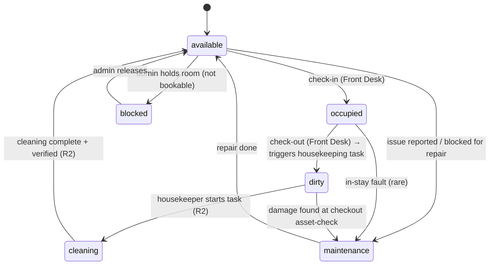
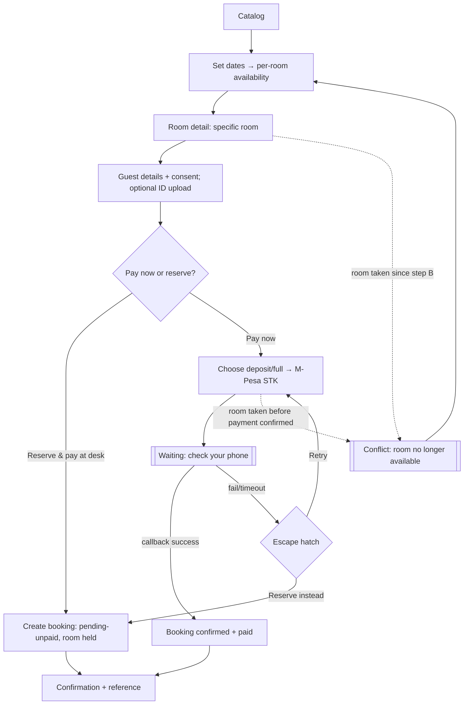
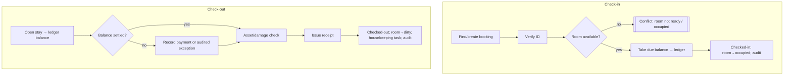

# SommyComfort — EXPERIENCE

How the two highest-risk MVP flows behave: every empty / loading / error / offline / conflict state, plus the room-status state machine both Front Desk and Housekeeping share. Visual identity is `DESIGN_SYSTEM.md`; this spine owns behavior and wins over any mock on conflict.

## Foundation

- **Form factor:** installable mobile-first **PWA**. Two audiences: **guests** on their own phones (often slow/flaky mobile data) and **staff** on shared mid-range Android devices, sometimes offline.
- **UI system:** shadcn-style primitives on Tailwind v4 (`apps/web/src/components/ui/` from Story 1.3). This doc specifies only behavioral deltas.
- **Connectivity is a first-class state, not an edge case.** Every flow below defines its offline behavior. Guest booking requires connectivity (it touches money + availability); staff actions degrade gracefully where safe (Housekeeping in R2 queues offline — out of MVP scope here).
- **Money is exact and visible.** Amounts render as `KES 3,500.00` (JetBrains Mono), always from the server-computed ledger, never client math. (architecture: integer cents.)

## Voice and Tone (microcopy)

- Calm, plain, operational. Short sentences. No jargon for guests; terse labels for staff under time pressure.
- **Money + errors are explicit and reassuring.** Never a bare "Error." Say what happened, whether money moved, and the next action. e.g. *"We didn't receive your M-Pesa payment. No money has left your account. Try again or reserve and pay at the property."*
- Kenyan context: KES, M-Pesa, "ID/passport," local phone format `+254 7XX XXX XXX`.

## State Patterns (canonical — reused everywhere)

| State | When | What the user sees | Recovery |
|---|---|---|---|
| **Loading** | awaiting server/network | skeletons for content; inline spinner + disabled control for actions (never a bare full-screen spinner on a form) | n/a |
| **Empty** | no data yet | friendly empty state w/ the primary action (e.g. "No bookings yet — Create booking") | the CTA |
| **Error (recoverable)** | request failed, retryable | inline message stating what failed + Retry; preserve entered data | Retry / edit |
| **Error (terminal)** | not retryable (validation, conflict) | specific message + the corrective path | corrective action |
| **Offline** | no connectivity | persistent offline banner; network-dependent actions disabled with "You're offline" tooltip; cached views still readable | auto-resumes on reconnect |
| **Conflict** | resource changed under the user (room taken, balance changed) | explicit conflict state with the new reality + options | choose alternative / refresh |
| **Success** | action committed | confirmation with the durable reference (booking ref, receipt) + next step | — |

Status is **never conveyed by color alone** — always a label/icon too (accessibility floor).

## The Room-Status Model (shared by Front Desk + Housekeeping)

The single source of truth both flows read/write. Statuses (from `data-model.md` `RoomStatus`): `available · occupied · dirty · cleaning · maintenance · blocked`.

**Rules that bind the flows:**
- A room is **bookable/checkin-able only from `available`.** Front-desk check-in must reject a room not `available` (it's the conflict guard).
- **Check-out always moves `occupied → dirty`** and creates a housekeeping task (MVP creates the task record + flips status even though the Housekeeping workspace ships in R2).
- `cleaning → available` transition exists in the model now (so MVP doesn't need a migration later) but the housekeeper UI that drives it is **R2**; in MVP an authorized staffer can mark a room clean from the room-status view.
- Every transition writes an `audit_log` row (actor, from, to, timestamp).

---

## Key Flow 1 — Guest Booking with Payment

**Protagonist:** *Wanjiku, booking a room from her phone on patchy 3G the night before travel.* She wants a specific room, and she's nervous about paying online.

**Happy path (numbered):**
1. **Catalog** → Wanjiku browses available rooms (cards show status, KES/night, capacity, location).
2. **Dates** → she sets check-in/out; catalog re-filters to rooms free for the whole range (per-room availability; **specific room** model).
3. **Room detail** → gallery, amenities, rules, price; "Book this room."
4. **Guest details** → name, phone (+254), email, DOB, nationality, ID type + number; required consent checkbox. Optional **ID photo upload** (front/back) — skippable on slow data, can be done at check-in.
5. **Payment choice** → *Guest chooses*: **Pay now** (deposit or full, via M-Pesa) **or** **Reserve & pay at the property**.
6. **★ Climax — payment:**
   - **Reserve & pay at desk:** booking is created immediately as **pending-unpaid**, room held; go to confirmation. No block.
   - **Pay now (M-Pesa):** STK push sent; Wanjiku sees the **"Check your phone" waiting screen** (live status). The booking is **not confirmed until the callback succeeds** (block-until-confirmed). On success → confirmed + paid. On **fail/timeout → escape hatch**: Retry, or switch to "reserve & pay at the property" (never stranded).
7. **Confirmation** → booking reference `BK-XXXX`, what was paid / what's due at check-in, cancellation terms (refundable **minus fee**), and a lookup link.

### State Inventory — Booking

| # | State | Trigger | Guest sees | Recovery / rule |
|---|---|---|---|---|
| B1 | Catalog empty | no rooms configured / none match dates | "No rooms available for these dates" + change-dates CTA | adjust dates |
| B2 | Availability loading | querying | room-card skeletons | — |
| B3 | Validation error | bad/missing guest fields, consent unchecked, bad phone | inline field errors; no booking created; entered data preserved | fix fields |
| B4 | ID upload slow/fails | large image on 3G | upload is optional + non-blocking; "Add at check-in instead" | skip; capture at desk |
| B5 | **M-Pesa waiting** | STK sent, pay-now | "Check your phone for the M-Pesa prompt" + live status + cancel | wait; auto-advances on callback |
| B6 | **M-Pesa success** | callback `ResultCode 0` | "Payment received — booking confirmed" + ref + amount | → confirmation |
| B7 | **M-Pesa failed** | callback non-zero (cancelled/insufficient) | "Payment didn't go through. **No money has left your account.**" + Retry / reserve-instead | escape hatch |
| B8 | **M-Pesa timeout** | no callback within window | "We haven't heard back from M-Pesa yet." status-query result; Retry / reserve-instead | never auto-confirm; never lose the draft |
| B9 | **Amount mismatch** | paid ≠ requested | booking confirmed but flagged for reconciliation; guest sees paid amount | desk/accounts reconcile (Epic 5) |
| B10 | **Conflict: room taken** | specific room booked by someone else between steps 2 and 6 | "Sorry — Room 103 was just booked. Here are similar available rooms." | pick alternative → re-confirm |
| B11 | Offline | guest loses data mid-flow | "You're offline — booking needs a connection" banner; pay-now disabled | resume on reconnect; draft preserved locally where possible |
| B12 | Confirmation / lookup | booking created | reference + paid/due + cancel terms; "Look up later with reference + phone" | — |

> **Architecture note (feeds Epic 4/5):** the "block-until-confirmed" pay-now path means the **confirmed** booking is committed only after the M-Pesa callback succeeds; a transient payment-pending record may exist during the STK wait but must not hold the room indefinitely. The **specific-room conflict (B10)** is why Winston's Postgres exclusion-constraint on `(room, date-range)` is required — availability must be re-checked atomically at confirm, not just at search.

---

## Key Flow 2 — Front Desk check-in / check-out

**Protagonist:** *Otieno at the front desk, a walk-in guest in front of him, taking payment on the shared Android tablet.* Speed and correctness matter; the guest is watching.

### Check-in
1. Find the booking (search by ref/name/phone) or create a walk-in booking.
2. Verify ID (confirm captured ID, or capture now).
3. **Guard:** the room must be `available`. If not → conflict state (B-room).
4. Take any due balance (cash / M-Pesa manual or STK / card) → posts to the **ledger**.
5. Confirm → booking `checked-in`, room `available → occupied`, audited. Target < 90s.

### Check-out
1. Open the stay → see the **ledger balance** (server-computed).
2. **Settle balance** (record final payment) — outstanding balance warns and requires payment or an audited exception.
3. **Asset/damage check** → discrepancies create a damage charge (and may flip room → `maintenance`).
4. Issue **receipt** (PDF).
5. Confirm → booking `checked-out`, room `occupied → dirty`, **housekeeping task created**, audited.

### State Inventory — Front Desk

| # | State | Trigger | Staff sees | Recovery / rule |
|---|---|---|---|---|
| F1 | No bookings (empty) | quiet day / search miss | empty state + "Create booking" | create walk-in |
| F2 | Loading | fetching booking/ledger | skeleton rows; never block the whole desk | — |
| F3 | **Room not available at check-in** | room is dirty/occupied/maintenance/blocked | conflict: "Room 103 is {status}." Options: assign different available room, or hold | pick available room |
| F4 | **Outstanding balance at check-out** | ledger balance > 0 | warn: "KES X due." Must record payment or log an audited exception | take payment / exception |
| F5 | M-Pesa at desk (STK) | staff-initiated STK | same waiting/success/fail/timeout as B5–B8 | retry / record manual ref / cash |
| F6 | **M-Pesa manual reference** | guest paid out-of-band | record receipt code + amount → ledger, flagged unreconciled | reconcile later |
| F7 | Damage/missing asset | checkout asset-check | record charge; optionally room → maintenance | charge posts to ledger |
| F8 | Offline | tablet loses wifi | banner; **read** cached bookings; **block** money actions (no offline payments in MVP) | resume on reconnect |
| F9 | Concurrent edit | two staff act on one booking | optimistic-concurrency conflict → "This booking changed, refresh" | refresh + redo |
| F10 | Success | check-in/out committed | confirmation + receipt; room status visibly updates | — |

---

## Accessibility Floor (behavioral)

- Every interactive element is keyboard-reachable with a **visible focus ring** (`{border-focus}` token); real `<button>`/`<a>` semantics (no div-buttons).
- **Status never by color alone** — pair every status chip/dot with a label or icon (critical for the caretaker/colorblind, and in sunlight).
- Form fields have real `<label>`s; errors are programmatically associated (`aria-describedby`) and announced.
- Large tap targets (≥44px) for staff flows; fixed bottom action bar on mobile so the primary action is thumb-reachable.
- Money and references use the mono font and are selectable/copyable.
- M-Pesa waiting + result states are announced via `aria-live` (guests may not be watching the screen).

## Open Items (for Admin settings / later flows)

- Deposit amount/percent + cancellation-fee value → Admin settings (Epic 3 / FR13).
- No-show fee model (assume = cancellation fee) — confirm.
- STK wait timeout duration (assume 60–90s) — align with `mpesa-daraja-integration-spec.md` status-query fallback.
- Housekeeping/Caretaker offline flows + asset-check UI → R2 (Epic 7) — this doc fixes only the shared room-status model they depend on.
